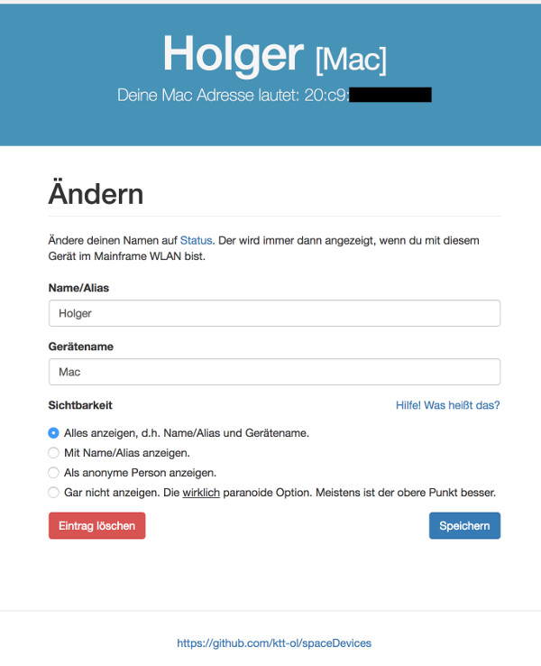

# SpaceDevices

Gets the current active mac/IP combination from our wifi access points via mqtt (sessionTopic). Has a global database (masterFile) 
and a user customizable database (userFile). The last one is changeable via a web interface. Any client can only change the entry
for its current mac address. 

As result an json string is sent via mqtt (devicesTopic), e.g.:
````json
{  
  "people":[  
    {  
      "name":"Hans",
      "devices":[  
        {  
          "name":"Handy",
          "location":"Space"
        },
        {  
          "name":"Thinkpad",
          "location":"Space"
        }
      ]
    },
    {  
      "name":"Jon",
      "devices":[  
        {  
          "name":"Handy",
          "location":"Space"
        },
        {  
          "name":"Mac",
          "location":"Space"
        }
      ]
    }
  ],
  "peopleCount":8,
  "deviceCount":38,
  "unknownDevicesCount":18
}
```` 

The web interface:




# Dependencies

Install all dependencies with
```
dep ensure
```


# Build

```
go build cmd/spaceDevices.go
# or use the script 
./do.sh build-linux
```


# Config

Copy `config.example.toml` to `config.toml` and change as you like. 


# Run

```
./spaceDevices
# or for production mode
GIN_MODE=release ./spaceDevices 
```

You can also use the systemd service file `extras/spaceDevicesGo.service`

